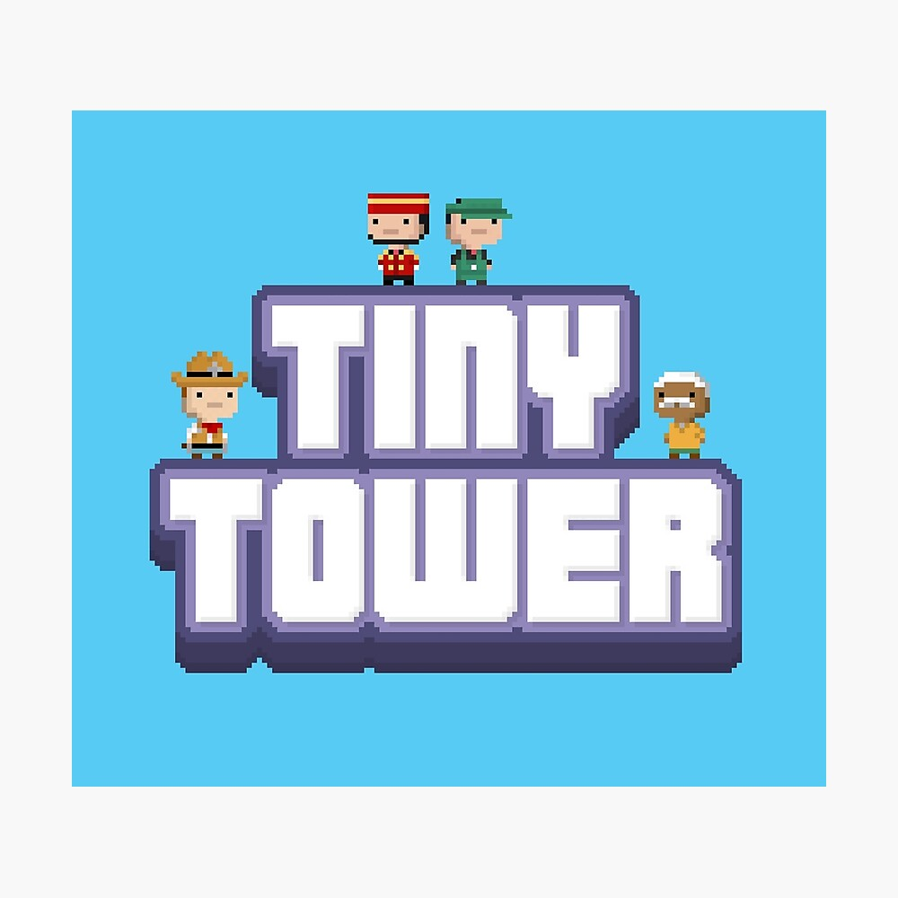

<!-- Improved compatibility of back to top link: See: https://github.com/othneildrew/Best-README-Template/pull/73 -->

<a name="readme-top"></a>

<!--
*** Thanks for checking out the Best-README-Template. If you have a suggestion
*** that would make this better, please fork the repo and create a pull request
*** or simply open an issue with the tag "enhancement".
*** Don't forget to give the project a star!
*** Thanks again! Now go create something AMAZING! :D
-->

<!-- PROJECT SHIELDS -->
<!--
*** I'm using markdown "reference style" links for readability.
*** Reference links are enclosed in brackets [ ] instead of parentheses ( ).
*** See the bottom of this document for the declaration of the reference variables
*** for contributors-url, forks-url, etc. This is an optional, concise syntax you may use.
*** https://www.markdownguide.org/basic-syntax/#reference-style-links
[![Contributors][contributors-shield]][contributors-url]
[![Forks][forks-shield]][forks-url]
[![Stargazers][stars-shield]][stars-url]
[![Issues][issues-shield]][issues-url]
[![MIT License][license-shield]][license-url]
[![LinkedIn][linkedin-shield]][linkedin-url]
-->

<!-- PROJECT LOGO -->
<br />
<div align="center">
  <a href="https://github.com/justsweat/BotTinyTowers">
    
  </a>

  <h3 align="center">BotTinyTowers</h3>

  <p align="center">
    Making Tiny Towers Idle
    <br />
    <a href="https://github.com/justsweat/BotTinyTowers"><strong>Explore the docs »</strong></a>
    <br />
    <br />
    <a href="https://github.com/justsweat/BotTinyTowers">View Demo</a>
    ·
    <a href="https://github.com/justsweat/BotTinyTowers/issues">Report Bug</a>
    ·
    <a href="https://github.com/justsweat/BotTinyTowers/issues">Request Feature</a>
  </p>
</div>

<!-- TABLE OF CONTENTS -->
<details>
  <summary>Table of Contents</summary>
  <ol>
    <li>
      <a href="#about-the-project">About The Project</a>
    </li>
    <li>
      <a href="#getting-started">Getting Started</a>
      <ul>
        <li><a href="#prerequisites">Prerequisites</a></li>
        <li><a href="#installation">Installation</a></li>
      </ul>
    </li>
    <li><a href="#usage">Usage</a></li>
    <li><a href="#roadmap">Roadmap</a></li>
    <li><a href="#contributing">Contributing</a></li>
    <li><a href="#license">License</a></li>
    <li><a href="#contact">Contact</a></li>
    <li><a href="#acknowledgments">Acknowledgments</a></li>
  </ol>
</details>

<!-- ABOUT THE PROJECT -->

## About The Project

I wanted to run Tiny Towers even when I'm doing something else. It started off just trying to automate certain areas of the game, but I've added more modules over time and have more applications it could automate.

Be mindful that there's still a lot of time that manual tinkering is needed, but when it's working, it works great!

<p align="right">(<a href="#readme-top">back to top</a>)</p>

<!-- GETTING STARTED -->

## Getting Started

To get a local copy up and running follow these steps.

### Prerequisites

I ran this on windows, and you will need 2 things:

You will need 2 things:

- python
- android player, either Nox of Bluestacks

### Installation

1. Clone the repo
   ```sh
   git clone https://github.com/justsweat/BotTinyTowers.git
   ```
2. Install requirements
   ```sh
   pip install -r requirements.txt
   ```

<p align="right">(<a href="#readme-top">back to top</a>)</p>

<!-- USAGE EXAMPLES -->

## Usage

First you have to run Tiny Towers on Nox or Bluestacks, then run this bot using vscode or python. it'll read the location of the player first, and all objects will then be relative to the player. The bot will control your mouse to play the game for you, so you will also lose control of the PC.

**Press 'Q' to quit after running any module**

There's few modules that can be run:

### 1. Elevator Module

**Run this module to automate the elevator**

This module automates the elevator by scanning the elevator button and send bits up to the relevant floor. It uses the **fps.json** to determine the multiplier. The current settings is for maxed out speed at 10.00 + 1.25. Adjust the json accordingly to your current speed.

There are times when the bits doesn't send it up properly, so I've added a self-adjustment of 5 floors up.
eg. if the destination is floor 25, and the bot only sends it to floor 23, the bot will move the elevator up one floor and check again, for 5 times.

### 2. Auto-elevator module

**Run this module when you get the 60 mins auto-elevator power up**

This module will just wait for a certain time before scanning for the elevator button and click it.

### 3. Parachute module

**Run this module to catch any parachute**

> Required to turn off ads for this module

This module will first scroll to the top of the tower and waits for the parachute to catch it. It's required to turn off the ads but i find it's better that way. 7-8 hours of idle parachute catching can yield 200k coins

### 4. Sweep module

**Run this module to catch any objects in the tower**

This module is used to sweep the tower from bottom to top for objects such as lucky wheel ticket. You can also catch other objects by screenshot and cutting a portion of the object and saving it to the objects folder. (See folder for existing objects)

### Json files

- fps.json - multiplier for elevetor bot, adjust this accordingly
- gt.json - the number of golden ticket you have, used for counting coins you are making in one session
- last_raffle.json - a date and time to note the last raffle joined

<p align="right">(<a href="#readme-top">back to top</a>)</p>

<!-- ROADMAP -->

## Roadmap

- [x] No roadmap yet but will consider if there's feature request

See the [open issues](https://github.com/justsweat/BotTinyTowers) for a full list of proposed features (and known issues).

<p align="right">(<a href="#readme-top">back to top</a>)</p>

<!-- CONTRIBUTING -->

## Contributing

Contributions are what make the open source community such an amazing place to learn, inspire, and create. Any contributions you make are **greatly appreciated**.

If you have a suggestion that would make this better, please fork the repo and create a pull request. You can also simply open an issue with the tag "enhancement".
Don't forget to give the project a star! Thanks again!

1. Fork the Project
2. Create your Feature Branch (`git checkout -b feature/AmazingFeature`)
3. Commit your Changes (`git commit -m 'Add some AmazingFeature'`)
4. Push to the Branch (`git push origin feature/AmazingFeature`)
5. Open a Pull Request

<p align="right">(<a href="#readme-top">back to top</a>)</p>

<!-- LICENSE -->

## License

Distributed under the MIT License. See `LICENSE.txt` for more information.

<p align="right">(<a href="#readme-top">back to top</a>)</p>

<!-- CONTACT -->

## Contact

Your Name - [@Discord](https://discordapp.com/users/560864539927642130) - email@example.com

Project Link: [https://github.com/justsweat/BotTinyTowers](https://github.com/justsweat/BotTinyTowers)

<p align="right">(<a href="#readme-top">back to top</a>)</p>

<!-- ACKNOWLEDGMENTS -->

## Acknowledgments

Use this space to list resources you find helpful and would like to give credit to. I've included a few of my favorites to kick things off!

- [Best readme template](https://github.com/othneildrew/Best-README-Template)
- [Choose an Open Source License](https://choosealicense.com)

<p align="right">(<a href="#readme-top">back to top</a>)</p>

<!-- MARKDOWN LINKS & IMAGES -->
<!-- https://www.markdownguide.org/basic-syntax/#reference-style-links -->

[contributors-shield]: https://img.shields.io/github/contributors/othneildrew/Best-README-Template.svg?style=for-the-badge
[contributors-url]: https://github.com/justsweat/BotTinyTowers/graphs/contributors
[forks-shield]: https://img.shields.io/github/forks/othneildrew/Best-README-Template.svg?style=for-the-badge
[forks-url]: https://github.com/othneildrew/Best-README-Template/network/members
[stars-shield]: https://img.shields.io/github/stars/othneildrew/Best-README-Template.svg?style=for-the-badge
[stars-url]: https://github.com/othneildrew/Best-README-Template/stargazers
[issues-shield]: https://img.shields.io/github/issues/othneildrew/Best-README-Template.svg?style=for-the-badge
[issues-url]: https://github.com/othneildrew/Best-README-Template/issues
[license-shield]: https://img.shields.io/github/license/othneildrew/Best-README-Template.svg?style=for-the-badge
[license-url]: https://github.com/othneildrew/Best-README-Template/blob/master/LICENSE.txt
[linkedin-shield]: https://img.shields.io/badge/-LinkedIn-black.svg?style=for-the-badge&logo=linkedin&colorB=555
[linkedin-url]: https://linkedin.com/in/othneildrew
[product-screenshot]: images/screenshot.png
[Next.js]: https://img.shields.io/badge/next.js-000000?style=for-the-badge&logo=nextdotjs&logoColor=white
[Next-url]: https://nextjs.org/
[React.js]: https://img.shields.io/badge/React-20232A?style=for-the-badge&logo=react&logoColor=61DAFB
[React-url]: https://reactjs.org/
[Vue.js]: https://img.shields.io/badge/Vue.js-35495E?style=for-the-badge&logo=vuedotjs&logoColor=4FC08D
[Vue-url]: https://vuejs.org/
[Angular.io]: https://img.shields.io/badge/Angular-DD0031?style=for-the-badge&logo=angular&logoColor=white
[Angular-url]: https://angular.io/
[Svelte.dev]: https://img.shields.io/badge/Svelte-4A4A55?style=for-the-badge&logo=svelte&logoColor=FF3E00
[Svelte-url]: https://svelte.dev/
[Laravel.com]: https://img.shields.io/badge/Laravel-FF2D20?style=for-the-badge&logo=laravel&logoColor=white
[Laravel-url]: https://laravel.com
[Bootstrap.com]: https://img.shields.io/badge/Bootstrap-563D7C?style=for-the-badge&logo=bootstrap&logoColor=white
[Bootstrap-url]: https://getbootstrap.com
[JQuery.com]: https://img.shields.io/badge/jQuery-0769AD?style=for-the-badge&logo=jquery&logoColor=white
[JQuery-url]: https://jquery.com
